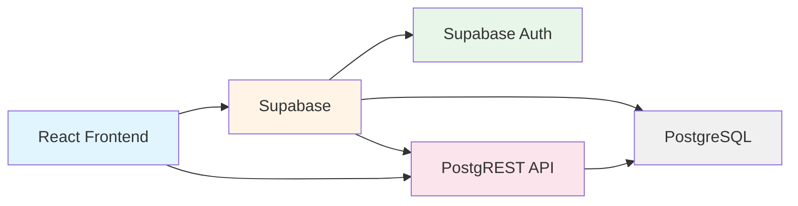

# AIIA Clinical Trials Dashboard - Project Documentation

## Overview

AIIA Clinical Trials Dashboard (SIH PS 26046) is a clinical-trial management dashboard for Ayurveda trials. The system handles study/trial tracking, KPIs and alerts, AE/SAE safety reporting and deadlines, role-based access, immutable audit logging, and one narrow AI feature. This is a 3-person, 7-day hackathon project built with a React frontend and Supabase backend.

## Architecture

The architecture uses Supabase as a unified backend service:
- **React Frontend**: Directly communicates with Supabase via the JavaScript client
- **Supabase Auth**: Handles user authentication and session management
- **PostgREST**: Auto-generates REST API from database tables and views
- **PostgreSQL**: Stores all data with Row-Level Security (RLS) policies
- **No custom backend server**: All business logic is implemented in database functions, triggers, and RLS policies

## Database Schema

### Tables

| Table | Purpose | Key Columns |
|-------|---------|-------------|
| `profiles` | User profiles linked to Supabase Auth | `id` (UUID, FK to auth.users), `full_name`, `role` (user_role), `site_id` (FK to sites), `profile_completed` |
| `studies` | Clinical trial studies | `id`, `title`, `ctri_number`, `phase`, `status` (study_status), `target_enrollment`, `pi_id` (FK to profiles), `ec_approval_date`, `ctri_registration_date`, `start_date`, `end_date`, `created_at`, `updated_at`, `ec_id` (FK to profiles, added via migration), `organization_id` (FK to organizations, added via migration) |
| `sites` | Study sites/locations | `id`, `study_id` (FK to studies), `name`, `location`, `activated_at`, `created_at` |
| `subjects` | Study participants (de-identified) | `id`, `study_id` (FK to studies), `site_id` (FK to sites), `subject_code`, `status` (subject_status), `enrollment_date`, `created_at` |
| `visits` | Subject visits (tracks protocol deviations) | `id`, `subject_id` (FK to subjects), `visit_name`, `scheduled_date`, `actual_date`, `is_deviation` (generated), `deviation_notes` |
| `adverse_events` | Adverse events/serious adverse events | `id`, `study_id` (FK to studies), `subject_id` (FK to subjects), `reported_by` (FK to profiles), `description`, `onset_date`, `severity` (ae_severity), `is_serious`, `meddra_term`, `who_drug_term`, `status` (ae_status), `reported_at`, `regulatory_deadline`, `reported_to_regulator_at`, `created_at` |
| `audit_log` | Immutable audit trail | `id` (bigint), `table_name`, `record_id`, `action`, `changed_by` (FK to profiles), `changed_at`, `old_data` (jsonb), `new_data` (jsonb) |
| `guideline_chunks` | AI/RAG support: regulatory guideline text chunks | `id`, `source`, `content`, `embedding` (vector) |
| `meddra_terms` | AI/RAG support: MedDRA terminology with embeddings | `id`, `term`, `code`, `embedding` (vector) |
| `study_submissions` | Ethics Committee submission workflow | `id`, `study_id` (FK to studies), `ec_id` (FK to profiles), `submitted_by` (FK to profiles), `status`, `comment`, `submitted_at`, `reviewed_at`, `reviewed_by` (FK to profiles), `review_comment` |
| `ae_reports` | Adverse event reporting workflow | `id`, `ae_id` (FK to adverse_events), `study_id` (FK to studies), `ec_id` (FK to profiles), `submitted_by` (FK to profiles), `report_comment`, `review_comment`, `submitted_at`, `status` (pending/submitted/approved/rejected), `reviewed_at`, `reviewed_by` (FK to profiles) |
| `organizations` | Organizations/sponsors running studies | `id`, `name`, `created_at` |
| `study_assignments` | Role-based study assignments (alternative to site-based) | `id`, `study_id` (FK to studies), `profile_id` (FK to profiles), `role` (user_role), `assigned_at` |
| `participant_interest` | Public participant interest form submissions | `id`, `full_name`, `email`, `phone`, `date_of_birth`, `condition_or_interest`, `study_id` (FK to studies), `status` (new/contacted/enrolled/declined), `notes`, `submitted_at`, `updated_at`, `updated_by` (FK to profiles) |

**Notes:**
- `organizations`, `study_assignments`, and `participant_interest` tables are created via separate migration files and are not included in the base `schema.sql`
- `studies.ec_id` and `studies.organization_id` are added via separate migration files
- `guideline_chunks` and `meddra_terms` tables exist in the schema but are not currently used by the frontend AI features (pending implementation)

### Views

| View | Purpose | Returns |
|------|---------|---------|
| `study_kpis` | Dashboard KPI calculations | `study_id`, `title`, `status`, `target_enrollment`, `actual_enrollment`, `enrollment_pct`, `deviation_count`, `open_ae_count`, `overdue_sae_count` |
| `study_alerts` | Configurable alerts system | `study_id`, `alert_type`, `message`, `severity`, `due_at` |

### Enums

| Enum | Values |
|------|--------|
| `user_role` | `principal_investigator`, `study_coordinator`, `monitor`, `ethics_committee`, `pharmacovigilance`, `admin`, `regulator_readonly` |
| `study_status` | `protocol_draft`, `ec_approval_pending`, `ec_approved`, `ctri_registered`, `enrolling`, `active`, `closed`, `suspended` (added via migration) |
| `subject_status` | `screening`, `enrolled`, `randomized`, `completed`, `withdrawn` |
| `ae_severity` | `mild`, `moderate`, `severe` |
| `ae_status` | `open`, `reported_to_ec`, `reported_to_regulator`, `closed` |

### Triggers

**Note:** `trg_audit_organizations` is created in organization_feature_migration.sql.

| Trigger | Table | Purpose |
|---------|-------|---------|
| `trg_set_ae_deadline` | `adverse_events` | Automatically sets `regulatory_deadline` (24h for SAE, 15 days for non-serious) on insert |
| `trg_audit_studies` | `studies` | Logs all insert/update/delete operations to `audit_log` |
| `trg_audit_subjects` | `subjects` | Logs all insert/update/delete operations to `audit_log` |
| `trg_audit_ae` | `adverse_events` | Logs all insert/update/delete operations to `audit_log` |
| `trg_audit_ae_reports` | `ae_reports` | Logs all insert/update/delete operations to `audit_log` |
| `trg_audit_organizations` | `organizations` | Logs all insert/update/delete operations to `audit_log` (organization_feature_migration.sql) |
| `on_auth_user_created` | `auth.users` | Auto-creates `profiles` row on signup with default role `study_coordinator` |

### RPC Functions

| Function | Purpose | Returns |
|----------|---------|---------|
| `mark_ae_reported(p_ae_id uuid)` | Mark an AE as reported to regulator (atomic action) | `adverse_events` row |
| `complete_profile_setup(p_full_name text)` | Complete first-login profile setup | JSON with updated profile data |
| `submit_ae_report(p_ae_id uuid, p_report_comment text)` | Submit AE report to Ethics Committee | `ae_reports` row |
| `review_ae_report(p_report_id uuid, p_review_comment text, p_status text)` | EC reviews AE report (approve/reject) | `ae_reports` row |
| `resume_suspended_study(p_study_id uuid)` | EC resumes a suspended study | `studies` row |
| `get_or_create_organization(p_name text)` | Admin-only: get existing org or create new one | `organizations` row |

**Note:** Additional functions exist in the schema (`set_ae_deadline`, `log_audit`, `handle_new_user`) but these are trigger functions used internally by the database, not RPC functions meant to be called by the frontend.

## API Contract

| Frontend/AI Action | Database Call | Returns |
|-------------------|---------------|---------|
| Log in | `supabase.auth.signInWithPassword()` | Session + user ID |
| Get my role | `select role from profiles where id = auth.uid()` | Role string |
| Complete profile setup | `supabase.rpc('complete_profile_setup', {p_full_name})` | JSON with profile data |
| Portfolio dashboard (PI) | `select * from study_assignments where role='principal_investigator'` + filtered studies/KPIs | Study data with KPIs |
| Portfolio dashboard (Coordinator) | `select * from study_assignments where role='study_coordinator'` + filtered studies/KPIs | Study data with KPIs |
| Portfolio dashboard (Monitor) | `select * from study_assignments where role='monitor'` + filtered studies/KPIs | Study data with KPIs |
| Study drill-down | `select * from studies where id = :id` + joined sites/subjects/assignments | Full study record |
| Log an AE | `insert into adverse_events(...)` | New row with auto-calculated `regulatory_deadline` |
| Mark AE reported | `supabase.rpc('mark_ae_reported', {p_ae_id})` | Updated row |
| Submit AE report to EC | `supabase.rpc('submit_ae_report', {p_ae_id, p_report_comment})` | `ae_reports` row |
| Review AE report (EC) | `supabase.rpc('review_ae_report', {p_report_id, p_review_comment, p_status})` | Updated `ae_reports` row |
| Resume suspended study (EC) | `supabase.rpc('resume_suspended_study', {p_study_id})` | Updated `studies` row |
| Get organizations | `select id, name from organizations order by name` | Organization list |
| Get/create organization | `supabase.rpc('get_or_create_organization', {p_name})` | `organizations` row |
| Audit log (admin/regulator) | `select * from audit_log` | Log rows (RLS-filtered) |
| AI: guideline lookup | `select * from guideline_chunks` | Chunks + embeddings (tables exist, AI features pending) |
| AI: MedDRA suggest | `select * from meddra_terms` | Terms + embeddings (tables exist, AI features pending) |
| Participant interest (public) | `insert into participant_interest(...)` (anon-only) | New row |
| Get participant interests | `select * from participant_interest` (staff-only) | Interest records |

## Role-Based Access Model

### Roles

- `principal_investigator` - Study lead with oversight responsibilities
- `study_coordinator` - Day-to-day study operations and data entry
- `monitor` - Site monitoring and oversight
- `ethics_committee` - Ethics review and approval decisions
- `pharmacovigilance` - Safety signal monitoring
- `admin` - System administration
- `regulator_readonly` - Read-only regulatory access

### RLS Policies (Verified Live)

**Note:** Policies for `organizations`, `study_assignments`, and `participant_interest` are defined in separate migration files, not in the base `schema.sql`.

#### profiles
- `profiles_read_own` - Users can read their own profile only

#### studies
- `studies_read` - All authenticated users can read studies
- `studies_write` - Admin, PI, and coordinator can insert studies

#### adverse_events
- `ae_read` - All authenticated users can read AEs
- `ae_write` - Coordinator, pharmacovigilance, and admin can insert AEs

#### subjects
- `subjects_read` - All authenticated users can read subjects
- `subjects_write` - Admin, PI, and coordinator can insert subjects

#### audit_log
- `audit_read` - Admin and regulator_readonly can read audit log
- No update/delete permissions (immutable)

#### study_submissions
- `study_submissions_read` - Admin, submitter, or assigned EC can read
- `study_submissions_insert` - Coordinator can insert submissions for their assigned studies

#### ae_reports
- `ae_reports_read` - Admin, submitter, or assigned EC can read

#### organizations (organization_feature_migration.sql)
- `organizations_read` - All authenticated users can read organizations
- No direct INSERT/UPDATE/DELETE (admin-only via RPC)

#### study_assignments (study_assignments_migration.sql)
- `study_assignments_read_own` - Users can read their own assignments; admins can read all
- `study_assignments_admin_insert` - Admins can insert assignments
- `study_assignments_admin_delete` - Admins can delete assignments

#### sites (sites_rls_migration.sql)
- `sites_read` - All authenticated users can read sites (if associated with an existing study)
- `sites_write` - Admins can insert new sites
- No UPDATE or DELETE policies (sites are immutable from client after creation)

#### participant_interest (phase23_participant_interest_migration.sql)
- `participant_interest_anon_insert` - Anonymous users can insert (public form)
- `participant_interest_staff_read` - Admin, coordinator, PI can read
- `participant_interest_staff_update` - Admin and coordinator can update

### Assignment Model

The system uses a hybrid assignment model:
1. **Site-based**: `profiles.site_id` links users to specific sites
2. **Study-based**: `study_assignments` table directly assigns users to studies with specific roles

Both models coexist, with study_assignments being the primary mechanism for PI, Coordinator, and Monitor access to studies.

## Built vs. Explicitly Out of Scope

### Built (Verified)
- Core database schema (studies, sites, subjects, visits, adverse_events, profiles)
- Supabase Auth integration
- Signup → profiles trigger with default role assignment
- AE/SAE deadline trigger (24h for serious, 15 days for non-serious)
- Immutable audit log with triggers
- `study_kpis` view for dashboard metrics
- `study_alerts` view for configurable alerts
- RLS enabled on all required tables
- Role/site/study isolation
- First-login profile setup workflow
- Ethics Committee submission workflow (`study_submissions`)
- AE report workflow (`ae_reports`)
- Organization management feature
- Study assignments table for role-based access
- Participant interest public form

### Pending / Not Done
- Full AI integration (guideline_chunks and meddra_terms tables exist but AI features not fully implemented)
- Some RLS policies are basic (e.g., studies_read allows all authenticated to read all studies)
- Additional RPC functions for complex workflows may be needed
- Frontend integration with all backend features (some features may not be fully wired in UI)

### Explicitly Out of Scope
- Custom Express/FastAPI backend server
- Email notifications beyond Supabase Auth defaults
- Advanced AI features beyond basic RAG lookup
- Real-time collaboration features
- Mobile applications
- Complex reporting beyond basic KPIs
